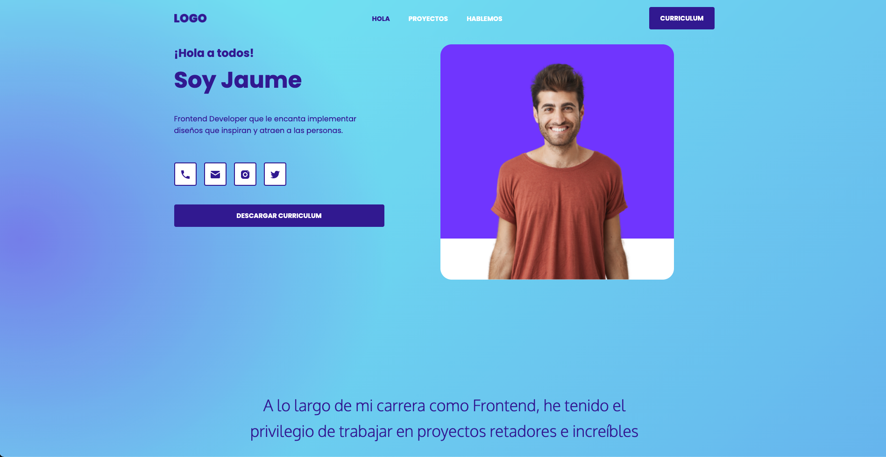
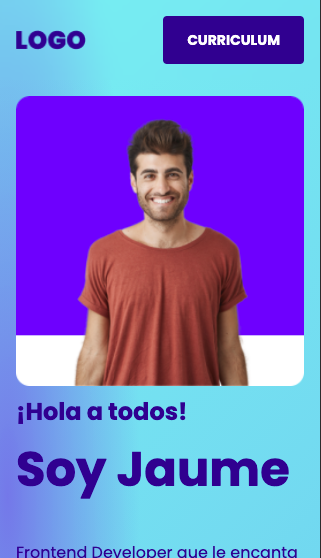

# Modelo de README para Github.
    
# 💎 Portafolio de Jaume


¿Te gustaría mostrar crear tu portafolio profesional y conseguir el trabajo de tus sueños? Aquí encontrarás la manera correcta de hacerlo.


Puedes verlo aquí: <https://adiezdev.github.io/portfolio-jaume/>


## 🔥 Instalación

```shell
Descargar el repositorio
```

## 🔍 Vistas 

### 💻 Desktop

<p align="center">
  
</p>

### 📱 Mobile

<p align="center">
  
</p>

## 📌 Stack
- HTML
- CSS3

## 🌟 Autor

* **<Tu nombre>**  - [@adiezdev](https://github.com/adiezdev)